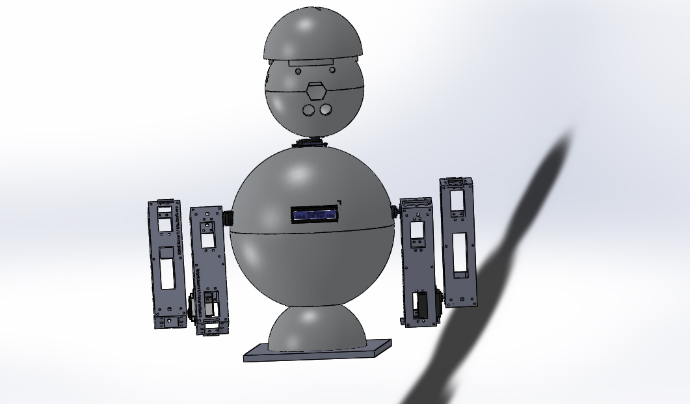

# Robotinics

[Português](README.md) · [English](README_EN.md) · [Español](README_ES.md)



Robotinics é uma plataforma aberta de robótica, automação e experimentação criada para integrar **mecânica, eletrônica, firmware, computação embarcada e software** em um mesmo projeto.

O objetivo não é oferecer apenas um robô pronto, mas uma base evolutiva para estudo, prototipagem e desenvolvimento de novas funcionalidades.

## Origem do projeto

O Robotinics nasceu em **2015** como **Trabalho de Conclusão de Curso (TCC)** do curso de **Técnico em Mecânica Industrial**, apresentado na **Etec José Martimiano da Silva**, em Ribeirão Preto/SP, unidade do **Centro Paula Souza**.

Esse contexto explica a natureza multidisciplinar do projeto desde sua origem: o trabalho não foi concebido apenas como software ou eletrônica, mas como um sistema integrado envolvendo **mecânica, fabricação de peças, eletrônica, acionamentos, sensores, microcontroladores e software**.

A partir do trabalho acadêmico original, o Robotinics continuou evoluindo como plataforma experimental, incorporando novas revisões mecânicas, placas eletrônicas, Arduino, Raspberry Pi, visão computacional e outros módulos de software.

Instituição: [Etec José Martimiano da Silva – Centro Paula Souza](https://www.cps.sp.gov.br/etecs/etec-jose-martimiano-da-silva/)

## Visão geral

O projeto reúne:

- estrutura mecânica e peças para fabricação e impressão 3D;
- projetos de placas eletrônicas e distribuição de alimentação;
- Arduino Mega como controlador principal de baixo nível;
- módulo de cabeça baseado em Arduino Nano;
- sensores, servomotores, motores, laser apontador e ultrassom;
- integração com Raspberry Pi;
- banco de dados e interface web;
- documentação didática e material histórico do projeto.

## Arquitetura

```text
                      Raspberry Pi
                 visão / software / lógica
                           │
                           │ serial
                           ▼
                     Arduino Mega
                controle físico principal
                  /        │         \
             motores    sensores    servos
                           │
                           ▼
                    MCabeca / Nano
                ┌──────────┼──────────┐
              Servo X    Servo Y    Ultrassom
                           │
                       Laser / LEDs
```

O Raspberry Pi fica responsável por processamento de mais alto nível. O Arduino Mega concentra a maior quantidade de I/O e executa o controle físico. O MCabeca é um módulo especializado da cabeça robótica.

## Módulos

| Módulo | Conteúdo |
|---|---|
| [Eletrônica](Eletronic/README.md) | esquemas, placas, alimentação e PCBs |
| [Mecânica](Mecanic/README.md) | SolidWorks, STL e peças estruturais |
| [Software](Software/README.md) | firmware, Raspberry, banco e interface |
| [Arduino](Software/arduino/README.md) | firmwares embarcados |
| [Mega](Software/arduino/robotinics/README.md) | controlador principal do robô |
| [MCabeca](Software/arduino/MCabeca/README.md) | cabeça ativa: servos, laser, LEDs e ultrassom |
| [Raspberry](Software/raspberry/README.md) | processamento de alto nível e I/O |
| [Robotinics AI](docs/ai/README.md) | TCHATGPT, internet, RAG, visão, agentes e documentação assistida |
| [Database](Software/database/README.md) | estrutura de dados do projeto |
| [Site](Software/site/README.md) | interface web histórica |
| [Documentação](docs/README.md) | manuais e material de referência |

## MCabeca e percepção ativa

O MCabeca possui dois servos associados a um **apontador laser**, LEDs e sensor ultrassônico. A intenção do módulo não é atuar como arma: o laser funciona como referência óptica e apontador visual.

Associado a uma câmera controlada pelo Raspberry Pi, o módulo pode ser usado para:

- apontamento visual;
- varredura angular;
- identificação do ponto laser na imagem;
- auxílio à estimativa de profundidade de uma câmera monocular;
- scanning de uma região;
- combinação de distância visual e ultrassônica;
- acompanhamento experimental de objetos.

A calibração visual pertence ao Raspberry Pi. O microcontrolador deve apenas receber e executar ângulos e comandos físicos.

## Continuação com IA no Raspberry Pi

A continuidade da Rev. 3 propõe o Raspberry Pi como **computador de bordo inteligente**, usando a biblioteca [TCHATGPT](https://github.com/marcelomaurin/CHATGPT) para integrar LLM, agentes, RAG, visão, voz e acesso controlado à internet.

A arquitetura preserva o princípio de segurança do projeto: a IA interpreta, pesquisa e planeja; o Arduino Mega continua responsável pelo controle físico determinístico.

Documentação: [docs/ai/README.md](docs/ai/README.md)

Para agentes de IA que precisem compreender ou atualizar este repositório, consulte também [AGENTS.md](AGENTS.md) e [AI_README.md](AI_README.md).

## Firmware

O projeto possui dois firmwares principais:

### Arduino Mega

Local: [Software/arduino/robotinics](Software/arduino/robotinics)

Responsável por controle do robô, motores, servos, sensores, comunicação e segurança básica.

### Arduino Nano — MCabeca

Local: [Software/arduino/MCabeca](Software/arduino/MCabeca)

Responsável pelo módulo de cabeça robótica.

Os firmwares estão passando por uma modernização mantendo compatibilidade com o hardware e o protocolo legado:

- PR #3 — refatoração do firmware do Mega;
- PR #4 — otimização do MCabeca para Arduino Nano.

## Estrutura do repositório

```text
robotinics/
├── Eletronic/
│   ├── arduino/
│   ├── eagle/
│   ├── pcb/
│   └── pcb wizzard/
├── Mecanic/
│   ├── solidwork/
│   └── stl/
├── Software/
│   ├── arduino/
│   │   ├── robotinics/
│   │   └── MCabeca/
│   ├── database/
│   ├── raspberry/
│   └── site/
└── docs/
```

## Documentação histórica

O repositório mantém o material completo produzido ao longo da evolução do projeto, inclusive o manual **Projetos IoT com Arduino e Raspberry**.

Consulte [docs/README.md](docs/README.md).

## Filosofia do projeto

Robotinics foi concebido como uma plataforma multidisciplinar. A evolução do projeto deve preservar quatro princípios:

1. hardware reproduzível;
2. módulos independentes;
3. protocolo compatível entre dispositivos;
4. separação entre controle físico e processamento de alto nível.

## Autor

**Marcelo Maurin Martins**

- GitHub: [marcelomaurin](https://github.com/marcelomaurin)
- Site: [Maurinsoft](https://maurinsoft.com.br)

---

Robotinics é um projeto experimental e educacional. Ao trabalhar com motores, alimentação elétrica, laser, baterias ou partes móveis, utilize procedimentos adequados de segurança.
