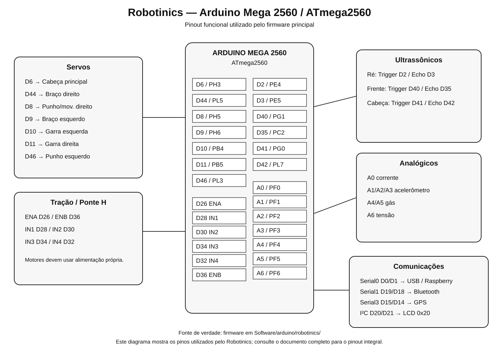

# Arduino Mega 2560 / ATmega2560 — Pinout Robotinics

[Índice](README.md) · [Firmware](../../../Software/arduino/robotinics/README.md)

O Arduino Mega 2560 é o controlador físico principal do Robotinics.

## Interfaces principais

| Recurso | Pinos Arduino Mega | Porta ATmega2560 | Uso Robotinics |
|---|---|---|---|
| Serial0 | D0 RX / D1 TX | PE0 / PE1 | USB/console, 115200 bps |
| Serial1 | D19 RX1 / D18 TX1 | PD2 / PD3 | Bluetooth, 9600 bps |
| Serial2 | D17 RX2 / D16 TX2 | PH0 / PH1 | reservado/associado historicamente a RF |
| Serial3 | D15 RX3 / D14 TX3 | PJ0 / PJ1 | GPS, 4800 bps |
| I²C | D20 SDA / D21 SCL | PD1 / PD0 | LCD I²C, endereço 0x20 |
| SPI | D50–D53 | PB3/PB2/PB1/PB0 | disponível; sem uso principal confirmado |

## Servomotores

| Função Robotinics | Pino Mega | ATmega2560 | Recurso |
|---|---:|---|---|
| Cabeça principal | D6 | PH3 | PWM |
| Braço direito | D44 | PL5 | PWM |
| Movimento/punho direito | D8 | PH5 | PWM |
| Braço esquerdo | D9 | PH6 | PWM |
| Garra esquerda | D10 | PB4 | PWM |
| Garra direita | D11 | PB5 | PWM |
| Punho esquerdo | D46 | PL3 | PWM |

Observação: a biblioteca `Servo` usa temporizadores internos e não depende exclusivamente do PWM de hardware do pino.

## Ponte H / tração

| Sinal | Pino Mega | ATmega2560 | Função |
|---|---:|---|---|
| ENA | D26 | PA4 | habilitação motor A |
| IN1 | D28 | PA6 | direção motor A |
| IN2 | D30 | PC7 | direção motor A |
| IN3 | D34 | PC3 | direção motor B |
| IN4 | D32 | PC5 | direção motor B |
| ENB | D36 | PC1 | habilitação motor B |

## Ultrassônicos

| Sensor | Trigger | MCU Trigger | Echo | MCU Echo |
|---|---:|---|---:|---|
| Ré | D2 | PE4 | D3 | PE5 |
| Frente | D40 | PG1 | D35 | PC2 |
| Cabeça/corpo | D41 | PG0 | D42 | PL7 |

## Entradas analógicas

| Função | Arduino | ATmega2560 |
|---|---|---|
| Corrente | A0 | PF0 / ADC0 |
| Acelerômetro X | A1 | PF1 / ADC1 |
| Acelerômetro Y | A2 | PF2 / ADC2 |
| Acelerômetro Z | A3 | PF3 / ADC3 |
| Sensor de gás | A4 | PF4 / ADC4 |
| Canal adicional gás | A5 | PF5 / ADC5 |
| Tensão | A6 | PF6 / ADC6 |

## Comunicação com controlador secundário

O firmware declara `SoftwareSerial mySerial(Arduino2TX, Arduino2RX)` com `Arduino2TX=38` e `Arduino2RX=37`. No construtor SoftwareSerial a ordem é receivePin, transmitPin.

| Papel real | Pino Mega | ATmega2560 |
|---|---:|---|
| RX SoftwareSerial | D38 | PD7 |
| TX SoftwareSerial | D37 | PC0 |

Os nomes históricos das constantes estão invertidos em relação à semântica do construtor. Não alterar a fiação apenas pelo nome da constante.

## Rádio frequência

| Sinal | Pino Mega | MCU |
|---|---:|---|
| RF RX | D17 | PH0 / RX2 |
| RF TX | D16 | PH1 / TX2 |

## Pinout digital completo do Mega

| Arduino | ATmega2560 | Arduino | ATmega2560 |
|---:|---|---:|---|
| D0 | PE0 | D27 | PA5 |
| D1 | PE1 | D28 | PA6 |
| D2 | PE4 | D29 | PA7 |
| D3 | PE5 | D30 | PC7 |
| D4 | PG5 | D31 | PC6 |
| D5 | PE3 | D32 | PC5 |
| D6 | PH3 | D33 | PC4 |
| D7 | PH4 | D34 | PC3 |
| D8 | PH5 | D35 | PC2 |
| D9 | PH6 | D36 | PC1 |
| D10 | PB4 | D37 | PC0 |
| D11 | PB5 | D38 | PD7 |
| D12 | PB6 | D39 | PG2 |
| D13 | PB7 | D40 | PG1 |
| D14 | PJ1 | D41 | PG0 |
| D15 | PJ0 | D42 | PL7 |
| D16 | PH1 | D43 | PL6 |
| D17 | PH0 | D44 | PL5 |
| D18 | PD3 | D45 | PL4 |
| D19 | PD2 | D46 | PL3 |
| D20 | PD1 | D47 | PL2 |
| D21 | PD0 | D48 | PL1 |
| D22 | PA0 | D49 | PL0 |
| D23 | PA1 | D50 | PB3 |
| D24 | PA2 | D51 | PB2 |
| D25 | PA3 | D52 | PB1 |
| D26 | PA4 | D53 | PB0 |

## Entradas analógicas completas

| Arduino | MCU | Arduino | MCU |
|---:|---|---:|---|
| A0 | PF0 | A8 | PK0 |
| A1 | PF1 | A9 | PK1 |
| A2 | PF2 | A10 | PK2 |
| A3 | PF3 | A11 | PK3 |
| A4 | PF4 | A12 | PK4 |
| A5 | PF5 | A13 | PK5 |
| A6 | PF6 | A14 | PK6 |
| A7 | PF7 | A15 | PK7 |

## Alimentação

Motores e servos não devem ser alimentados diretamente pelos pinos de I/O do ATmega2560. Documentar separadamente fonte de lógica, fonte de servos, fonte dos motores, reguladores, aterramento comum e proteções.

## Diagrama visual

