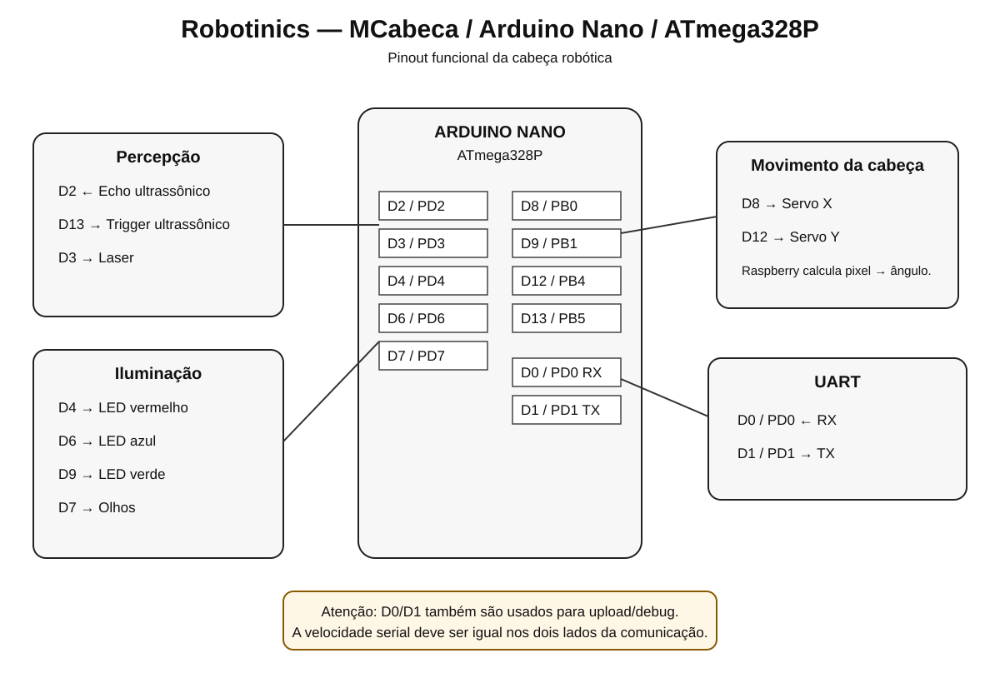

# MCabeca — Arduino Nano / ATmega328P

[Índice](README.md) · [MCabeca](../../../Software/arduino/MCabeca/README.md)

O MCabeca utiliza Arduino Nano / ATmega328P para controlar a cabeça física do Robotinics.

## Pinagem usada

| Função | Nano | ATmega328P | Recurso |
|---|---:|---|---|
| Echo ultrassônico | D2 | PD2 | INT0 |
| Laser | D3 | PD3 | PWM / INT1 |
| LED vermelho | D4 | PD4 | digital |
| LED azul | D6 | PD6 | PWM |
| Olhos | D7 | PD7 | digital |
| Servo X | D8 | PB0 | digital |
| LED verde | D9 | PB1 | PWM |
| Servo Y | D12 | PB4 | digital |
| Trigger ultrassônico | D13 | PB5 | SCK / LED onboard |

## UART

| Função | Nano | ATmega328P |
|---|---:|---|
| RX | D0 | PD0 / RXD |
| TX | D1 | PD1 / TXD |

No firmware histórico atualmente em `master`, a UART é inicializada em 57600 bps. Qualquer alteração de velocidade precisa ser feita nos dois lados da comunicação.

## Servo X/Y

- Servo X → D8 / PB0
- Servo Y → D12 / PB4

O Nano recebe ângulos; calibração de câmera e conversão pixel→ângulo pertencem ao Raspberry Pi.

## Laser

Laser → D3 / PD3. O laser é apontador/referência óptica. Se o módulo exigir corrente acima do permitido pelo I/O, usar transistor/MOSFET adequado.

## LEDs

- Vermelho → D4 / PD4
- Azul → D6 / PD6
- Verde → D9 / PB1
- Olhos → D7 / PD7

## Ultrassom

- Trigger → D13 / PB5
- Echo → D2 / PD2

## Pinout lógico do Nano

| Nano | ATmega328P | Observação |
|---:|---|---|
| D0 | PD0 | RX |
| D1 | PD1 | TX |
| D2 | PD2 | INT0 |
| D3 | PD3 | PWM / INT1 |
| D4 | PD4 | digital |
| D5 | PD5 | PWM |
| D6 | PD6 | PWM |
| D7 | PD7 | digital |
| D8 | PB0 | digital |
| D9 | PB1 | PWM |
| D10 | PB2 | PWM / SS |
| D11 | PB3 | PWM / MOSI |
| D12 | PB4 | MISO |
| D13 | PB5 | SCK |
| A0 | PC0 | ADC0 |
| A1 | PC1 | ADC1 |
| A2 | PC2 | ADC2 |
| A3 | PC3 | ADC3 |
| A4 | PC4 | ADC4 / SDA |
| A5 | PC5 | ADC5 / SCL |
| A6 | ADC6 | somente analógico |
| A7 | ADC7 | somente analógico |

## Alimentação

O Nano e os periféricos devem compartilhar referência de GND. Servos devem ter alimentação dimensionada adequadamente e não devem depender do regulador do Nano.

## Diagrama visual

