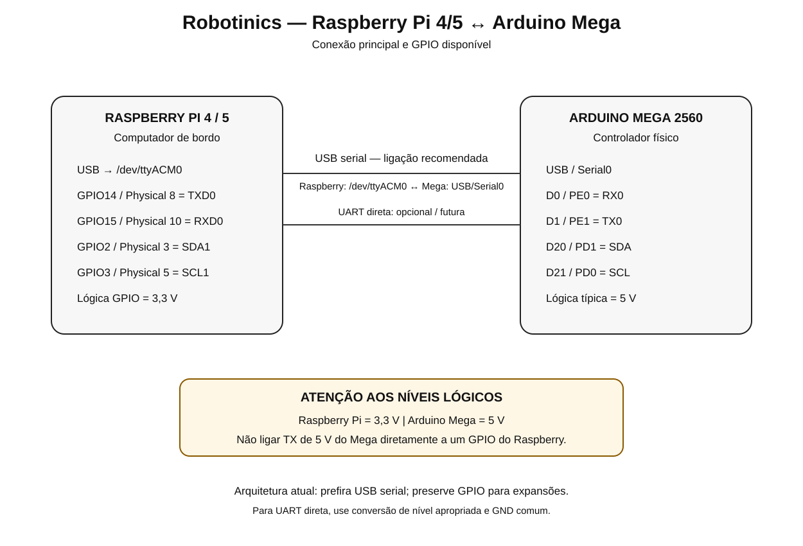

# Raspberry Pi 4/5 — GPIO de 40 pinos

[Índice](README.md) · [Raspberry Pi](../../../Software/raspberry/README.md)

O Raspberry Pi é o computador de bordo do Robotinics. O SoC Broadcom é BGA; para montagem/manutenção o pinout relevante é o header GPIO de 40 pinos.

## Header

| Physical | Função | Physical | Função |
|---:|---|---:|---|
| 1 | 3.3 V | 2 | 5 V |
| 3 | GPIO2 / SDA1 | 4 | 5 V |
| 5 | GPIO3 / SCL1 | 6 | GND |
| 7 | GPIO4 | 8 | GPIO14 / TXD0 |
| 9 | GND | 10 | GPIO15 / RXD0 |
| 11 | GPIO17 | 12 | GPIO18 / PWM0 |
| 13 | GPIO27 | 14 | GND |
| 15 | GPIO22 | 16 | GPIO23 |
| 17 | 3.3 V | 18 | GPIO24 |
| 19 | GPIO10 / MOSI | 20 | GND |
| 21 | GPIO9 / MISO | 22 | GPIO25 |
| 23 | GPIO11 / SCLK | 24 | GPIO8 / CE0 |
| 25 | GND | 26 | GPIO7 / CE1 |
| 27 | GPIO0 / ID_SD | 28 | GPIO1 / ID_SC |
| 29 | GPIO5 | 30 | GND |
| 31 | GPIO6 | 32 | GPIO12 / PWM0 |
| 33 | GPIO13 / PWM1 | 34 | GND |
| 35 | GPIO19 / PWM1 / PCM_FS | 36 | GPIO16 |
| 37 | GPIO26 | 38 | GPIO20 / PCM_DIN |
| 39 | GND | 40 | GPIO21 / PCM_DOUT |

## Uso atual no Robotinics

A arquitetura moderna prevê Raspberry Pi ↔ Arduino Mega por USB serial: Raspberry USB → `/dev/ttyACM0` → USB/Serial0 do Mega.

Portanto GPIO14/GPIO15 não são necessários para a comunicação principal.

## UART GPIO futura

- Physical 8 = GPIO14 / TXD0
- Physical 10 = GPIO15 / RXD0
- Physical 6 = GND

### Atenção

O Raspberry Pi usa lógica de 3,3 V. O Arduino Mega usa tipicamente 5 V. Nunca conecte diretamente uma saída de 5 V do Mega a um GPIO do Raspberry. Use conversor de nível apropriado.

## I²C

- Physical 3 = GPIO2 / SDA1
- Physical 5 = GPIO3 / SCL1

## SPI

- Physical 19 = GPIO10 / MOSI
- Physical 21 = GPIO9 / MISO
- Physical 23 = GPIO11 / SCLK
- Physical 24 = GPIO8 / CE0
- Physical 26 = GPIO7 / CE1

## Alimentação

Os pinos 5 V e 3,3 V são alimentação, não GPIO. Nunca aplique 5 V em um GPIO BCM.

## Raspberry Pi 4 e 5

Para os sinais GPIO tradicionais documentados aqui, o header físico de 40 pinos mantém compatibilidade. Funções alternativas específicas do SoC devem ser confirmadas antes do uso.

## Diagrama de conexão com o Mega

